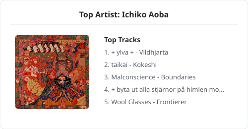

# Hi, I'm Michał

I am a computer science student and software developer focusing on backend architecture, systems programming, and low-level tooling. 

## 🛠 Professional Stack

**Core Languages & Runtimes:**
    

**Architecture & Containerization:**
   

### 💻 Top Languages

{{ GITHUB_LANGS }}

---

